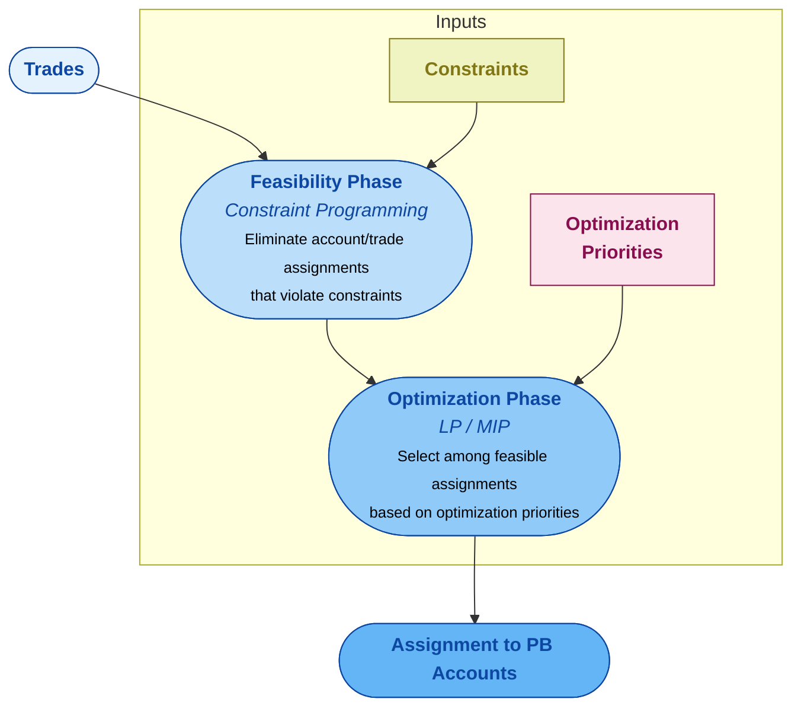
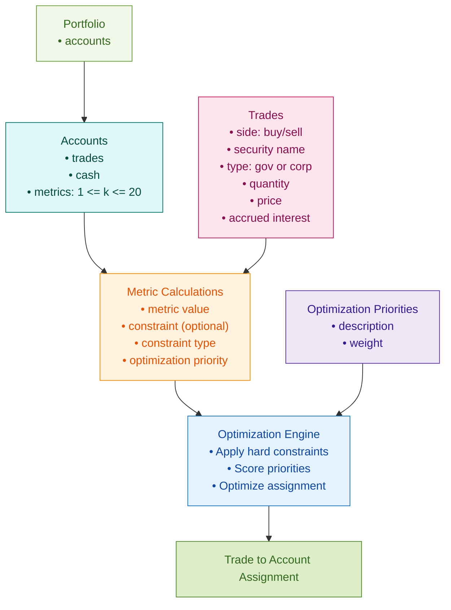

```mermaid
flowchart TD
    %% Node Definitions
    A(["<b>Trades</b>"]) --> B
    B(["<b>Feasibility Phase</b><br><i>Constraint Programming</i><br><font color='#000000' size='2'>Eliminate account/trade assignments<br>that violate constraints</font>"]) --> C
    C(["<b>Optimization Phase</b><br><i>LP / MIP</i><br><font color='#000000' size='2'>Select among feasible assignments<br>based on optimization priorities</font>"]) --> D
    D(["<b>Assignment to PB Accounts</b>"])

    %% Inputs
    subgraph Inputs
        E["<b>Constraints</b>"] --> B
        F["<b>Optimization<br>Priorities</b>"] --> C
    end

    %% Styles
    style A fill:#e3f2fd,color:#0d47a1,stroke:#0d47a1,stroke-width:1px
    style B fill:#bbdefb,color:#0d47a1,stroke:#0d47a1,stroke-width:1px
    style C fill:#90caf9,color:#0d47a1,stroke:#0d47a1,stroke-width:1px
    style D fill:#64b5f6,color:#0d47a1,stroke:#0d47a1,stroke-width:1px
    style E fill:#f0f4c3,color:#827717,stroke:#827717,stroke-width:1px
    style F fill:#fce4ec,color:#880e4f,stroke:#880e4f,stroke-width:1px
```

```mermaid
flowchart TD
    %% Inputs
    A1["Accounts<br>• trades<br>• cash<br>• metrics: 1 &lt;= k &lt;= 20"]
    A2["Portfolio<br>• accounts"]
    A3["Trades<br>• side: buy/sell<br>• security name<br>• type: gov or corp<br>• quantity<br>• price<br>• accrued interest"]

    %% Derived metrics
    M["Metric Calculations<br>• metric value<br>• constraint (optional)<br>• constraint type<br>• optimization priority"]

    %% Optimization context
    OP["Optimization Priorities<br>• description<br>• weight"]

    %% Engine
    E["Optimization Engine<br>• Apply hard constraints<br>• Score priorities<br>• Optimize assignment"]

    %% Output
    R["Trade to Account Assignment"]

    %% Arrows and Flow
    A1 --> M
    A2 --> A1
    A3 --> M
    M --> E
    OP --> E
    E --> R

    %% Styling
    style A1 fill:#e0f7fa,stroke:#00796b,color:#004d40
    style A2 fill:#f1f8e9,stroke:#689f38,color:#33691e
    style A3 fill:#fce4ec,stroke:#d81b60,color:#880e4f
    style M fill:#fff3e0,stroke:#fb8c00,color:#e65100
    style OP fill:#ede7f6,stroke:#5e35b1,color:#311b92
    style E fill:#e3f2fd,stroke:#1976d2,color:#0d47a1
    style R fill:#dcedc8,stroke:#558b2f,color:#33691e
```

