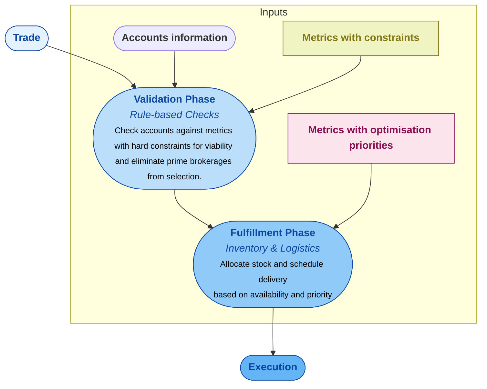
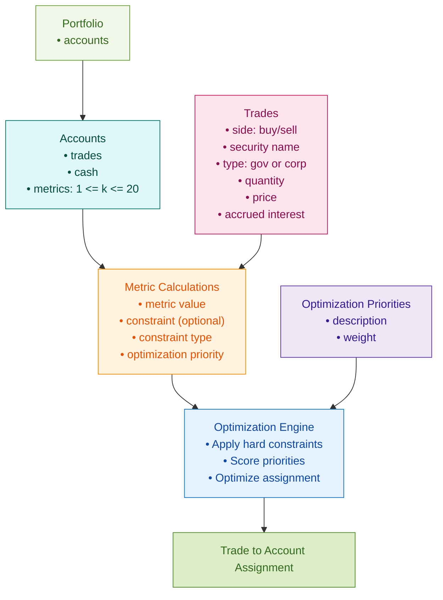

<section>
  <h2>Executive Summary</h2>
  

    This plan outlines the implementation of an execution optimization framework for a hedge fund operating across multiple prime brokers. The primary objective is to develop and deploy a cost reduction algorithm that intelligently allocates trades to prime brokers, minimizing overall execution costs while respecting key constraints such as liquidity, risk limits, and regulatory requirements. By integrating advanced optimization techniques, the system will enhance decision-making in trade assignment, balancing cost efficiency with operational feasibility. Successful implementation will lead to significant reductions in trading expenses, improved execution quality, and a stronger competitive position for the hedge fund.
  

</section>

<section>
  <h2>Algorithm Overview: Validation and Fulfillment Stages</h2>
  

    The diagram below provides a high-level overview of the execution optimization algorithm. It illustrates the two key stages of the process: the Validation Phase, where constraints and business rules are applied to ensure feasibility, and the Fulfillment Phase, where optimization priorities guide the selection of the best trade assignments. This structured approach ensures that all trade allocations comply with necessary restrictions while achieving cost-efficient execution across multiple prime brokers.
  

</section>

