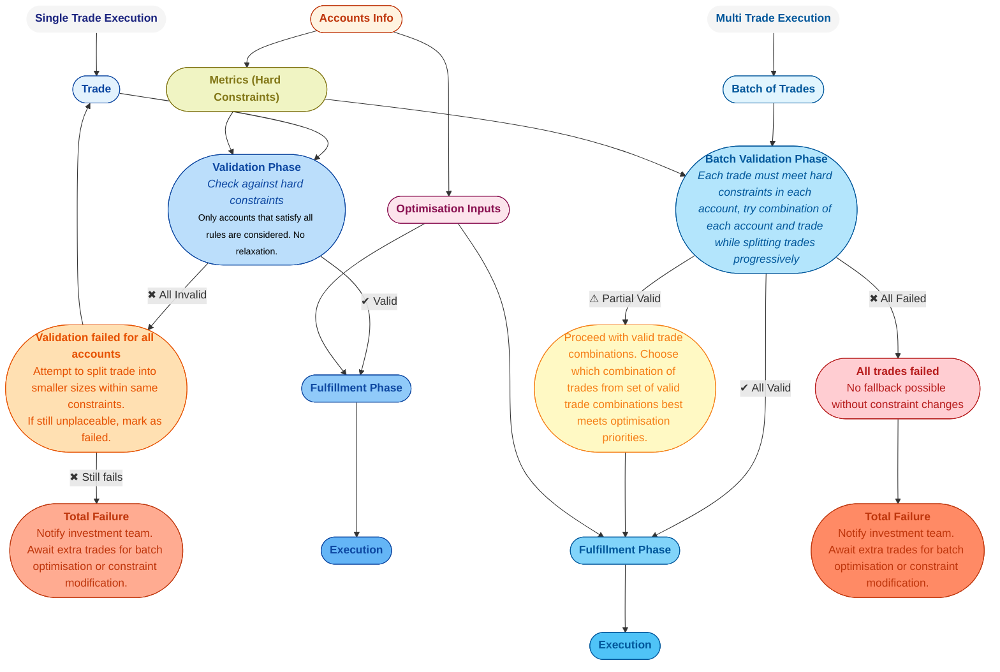
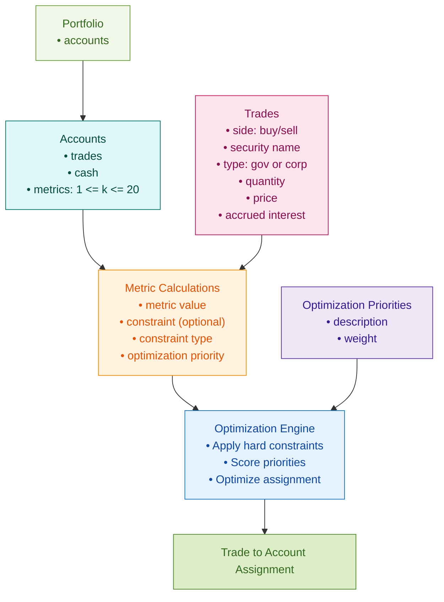

<section>
  <h2>Executive Summary</h2>
  

    This plan outlines the implementation of an execution optimization framework for a hedge fund operating across multiple prime brokers. The primary objective is to develop and deploy a cost reduction algorithm that intelligently allocates trades to prime brokers, minimizing overall execution costs while respecting key constraints such as liquidity, risk limits, and regulatory requirements. By integrating advanced optimization techniques, the system will enhance decision-making in trade assignment, balancing cost efficiency with operational feasibility. Successful implementation will lead to significant reductions in trading expenses, improved execution quality, and a stronger competitive position for the hedge fund.
  

</section>

<section>
  <h2>Algorithm Overview: Validation and Fulfillment Stages</h2>
  

    The diagram below provides a high-level overview of the execution optimization algorithm. It illustrates the two key stages of the process: the Validation Phase, where constraints and business rules are applied to ensure feasibility, and the Fulfillment Phase, where optimization priorities guide the selection of the best trade assignments. This structured approach ensures that all trade allocations comply with necessary restrictions while achieving cost-efficient execution across multiple prime brokers.
  

<h2> Single trade execution </h2>

  <h2>Execution Framework Overview</h2>
  
This model outlines the decision-making process for routing bond trades into appropriate Prime Brokerage (PB) accounts. It is split into two main paths based on the volume of trades: <strong>Single Trade Execution</strong> and <strong>Multi Trade Batch Execution</strong>. Each path aims to ensure account-level constraint compliance while optimizing for operational or financial priorities like financing cost and constraint headroom.

  <h3>Single Trade Execution</h3>
  
In this path, each trade is processed independently. The process follows a strict validation-first model, where the trade is only considered for accounts that fully satisfy all applicable hard constraints.

  <ul>
    <li><strong>Validation Phase:</strong> The trade is tested against all accounts. Only accounts where post-trade metric values remain within predefined constraints are considered.</li>
    <li><strong>Failure Handling:</strong> If no account satisfies the constraints, the trade is split into smaller sizes and re-tested. If still invalid, the trade is marked as a <em>total failure</em> and flagged for manual intervention.</li>
    <li><strong>Fulfillment Phase:</strong> If one or more valid accounts exist, the best one is selected (e.g., lowest cost or best optimization score), and the trade is executed.</li>
  </ul>

  <h3>Multi Trade Batch Execution</h3>
  
When multiple trades are available, the system leverages the opportunity to apply <strong>batch-level optimization</strong>. This enables more efficient use of constraint capacity and better overall performance on optimization priorities.

  <ul>
    <li><strong>Batch Validation Phase:</strong> Trades are evaluated in combinations, including partial splits across accounts. Each combination is tested against account-level constraints to form a pool of valid trade-account pairings.</li>
    <li><strong>Partial Success Handling:</strong> If only a subset of trades pass validation, the system identifies the <em>most optimal valid subset</em> (e.g., maximizing constraint headroom or minimizing financing cost) and proceeds with those.</li>
    <li><strong>Total Failure:</strong> If no valid trade combinations exist, the batch is halted, and the trades are flagged for review or rerun with modified constraints.</li>
    <li><strong>Fulfillment Phase:</strong> The valid trade-account assignments are executed, and metrics are updated accordingly.</li>
  </ul>

  <h3>Shared Data & Logic</h3>
  
Both paths use a shared pool of data, including:

  <ul>
    <li><strong>Account Information:</strong> Starting positions, constraints, and metric definitions.</li>
    <li><strong>Metrics Engine:</strong> Calculates each account’s post-trade metrics using weighted value formulas.</li>
    <li><strong>Optimization Inputs:</strong> Weights provided by the investment team (e.g., for cost, margin efficiency) are used in scoring and selection logic.</li>
  </ul>

  <h3>Design Philosophy</h3>
  
The system prioritizes constraint satisfaction — no trades are allowed to breach hard limits. Optimization is applied only <em>after</em> all constraints are satisfied. This two-stage design ensures regulatory and risk compliance while enabling smart allocation of trades across PB accounts to minimize cost and maximize operational efficiency.

